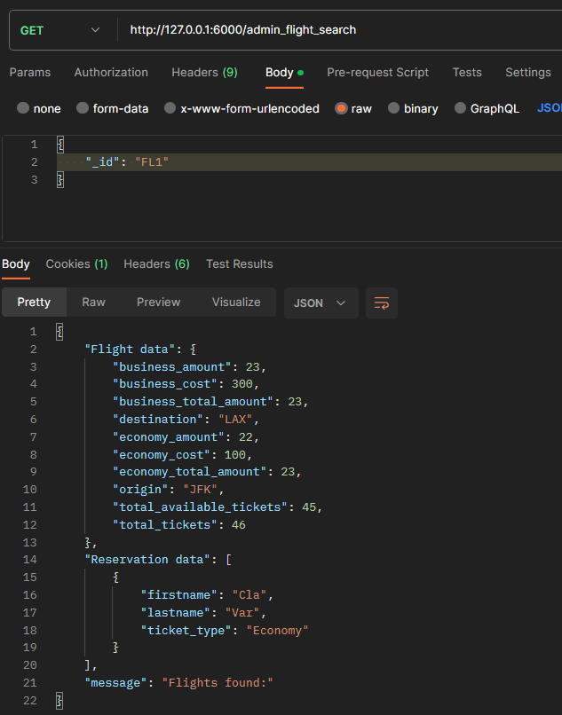

# Digital Airlines

Αυτή η εργασία αφορά τις λειτουργίες ενός website μίας αεροπορικής εταιρείας. 


## Οδηγείες χρήσης
Για την σωστή χρήση του προγράμματος προτείνεται να τρέξει όλη η εργασία μέσα απο τον φάκελο InfoSys. Επίσης, τα paths στο Dockerfile και στο docker-compose μπορεί να είναι διαφορετικά απο αυτά στο δικό σας σύστημα. Στην περίπτωση που κάποιο request δεν λειτουργήσει, παρακαλώ δοκιμάστε ξανά, πιθανόν να έγινε κάποιο λάθος με το docker-compose. Όταν ο κώδικας έτρεχε τοπικά δεν παρουσίζαι κάποιο πρόβλημα και δυστυχώς αυτή την στιγμή λόγω εξεταστικής δεν έχω τον χρόνο να επιλύσω το συγκεκριμένο θέμα. Παρόλα αυτά, η εισαγωγή της τιμής γίνεται κανονικά.

__Στοιχεία Admin__

Στα αρχεία του συστήματος, έχει γίνει ήδη η εισαγωγή του Admin
```code
{
    _id: 'ADM',
    firtname: 'Apostolos',
    lastname: 'Varelas',
    email: 'aposvarelas@gmail.com',
    password: '1234',
    date_of_dirth: '24-09-2002',
    country_of_origin: 'Greece',
    passport_number: '1234',
    type: 'Admin'
}
```

## Υλοποίηση Containerization

Αρχικά, χρειάστηκα ένα Virtual Machine για να εξομοιώσω το λειτουργικό σύστημα Ubuntu, μέσα στο οποίο έφτιαξα το docker μέσα στο οποίο θα έτρεχε ο κώδικας για τις λειτουργίες της σελίδες. Για να φτιάξω το docker, έπρεπε να χρησιμοποιήσω μία πληθώρα εντολών, για να εγκαταστήσω αρχικά το docker στον υπολογιστή, να κατεβάσω το image για την Mongo και στην συνέχεια να φτιάξω το Dockerfile και το docker-compose, με λίγα λόγια να κάνουμε Containerization, έτσι ώστε  οι εφαρμογές να εκτελούνται σε απομονωμένο περιβάλλον χρήστη που ονομάζονται container.


## Κώδικας
Αφού το docker ήταν έτοιμο και λειτουργικό, ξεκίνησα την διαδικασία ανάπτυξης του κώδικα ο οποίος χωρίζεται σε 2 κομμάτια. Τις διαδικασίες που μπορεί να κάνει μόνο ο admin και τις διαδικασίες που μπορούν να κάνουν από κοινού. Συγκεκριμένα:

### Λειτουργείες User/Admin

- __Εγγραφή στο σύστημα__

Αυτή η λειτουργεία εκτελείται μέσω στην συνάρτησης def register(), η οποία εκτελείται όταν για URL δοθεί το __localhost:6000/register__ με μέθοδο POST, αφού επιχειρείται εγγραφή στην βάση δεδομένων. Στην συγκεκριμένη συνάρτηση, ο χρήστης πρέπει να εισάγει τα το όνομα του (το οποίο χρησιμοποιείται και ως username), το επώνυμο του, το email του, τον κωδικό που επιθυμεί να χρησιμοποιεί στο σύστημα, την ημερομηνία γέννησης του, την χώρα καταγωγής του καθώς και τον αριθμό διαβατηρίου του. Για να γίνει σωστή εισαγωγή στοιχείων, θα πρέπει να υπάρχει η παρακάτω εισαγωγή στοιχείων	

```json
{
  "firstname": "",
  "lastname": "",
  "email": "",
  "password": "",
  "date_of_birth": "",
  "country_of_origin": "",
  "passport_number": ""
}
```
Με την σωστή εισαγωγή των στοιχείων, ο χρήστης εγγράφεται επιτυχώς στο σύστημα. Διαφορετικά, εμφανίζεται μήνυμα λάθους. Επιπλέον, αν υπάρχει ήδη λογαριασμός με το ίδιο username και email, τότε εμφανίζει και πάλι μήνυμα λάθους. Με την επιτυχής σύνδεση του χρήστη, του δίνεται μαζί ένα μοναδικό _id το οποίο είναι URi, όπου i ένας αύξοντα αριθμός, και ένα type το οποίο απο default είναι πάντα 'User'.

- __Σύνδεση στο σύστημα__

Αυτή η λειτουργεία εκτελείται μέσω στην συνάρτησης def login(), η οποία εκτελείται όταν για URL δοθεί το __localhost:6000/login__ με μέθοδο POST. Όταν ο χρήστης επιθυμεί να κάνει σύνδεση στο σύστημα θα πρέπει να κάνει request στο στην παραπάνω δίευθυνση, δίνοντας σωστά στοιχεία email και password. Η σωστή μορφή είναι η παρακάτω:
```json
{
  "email": "",
  "password": ""
}
```
Με την σωστή σύνδεση του χρήστη, δημιουργείται ένα session στο οποίο αποθηκεύεται το _id του χρήστη, ώστε να μπορεί να έχει πρόσβαση στις λειτουργείες του, και το type του χρήστη, ώστε ένας απλός χρήστης να μην μπορεί να εκτελέσει τις λειτουργείες του admin. Αυτό ελέγχεται απο την μεταβλητή session, την type, η οποία δείχνει τον τύπο του χρήστη (User ή Admin). Μόνο με την επιτυχής σύνδεση του χρήστη μπορούν να υλοποιηθούν οι παρακάτω λειτουργείες, διαφορετικά το σύστημα προτρέπει τον χρήστη να κάνει σύνδεση. Αυτό ελέγχεται απο την μεταβλητή session, την _id, η οποία αν δεν είναι άδεια, τότε σημαίνει ότι ο χρήστης έχει κάνει επιτυχής σύνδεση.

- __Έξοδος απο το σύστημα__

Όταν ο χρήστης επιθυμεί να κάνει έξοδο απο το σύστημα, το μόνο που έχει να κάνει είναι να παέι στο URL __localhost:6000/logout__ με μέθοδο POST. Μόλις ο χρήστης πατήσει αυτή την διεύθυνση, τότε αυτομάτως αποσυνδέεται απο το σύστημα. Αυτό γίνεται, διαγράφοντας τις τιμές του session στα πεδία _id και _type.

- __Αναζήτηση πτήσεων__

Όταν ο χρήστης επιθυμεί να κάνει αναζήτηση πτήσεων, θα πρέπει να παέι στο URL __localhost:6000/flight_search__ με μέθοδο GET, αφού το μόνο που χρειάζεται είναι να διαβάσει αρχεία απο την βάση δεδομένων. Εκεί, ο χρήστης έχει την επιλογή να ψάξει για πτήσεις με 4 διαφορετικούς τρόπους.
1. Βάση αεροδρόμιο προέλευσης και αεροδρόμιο τελικού προορισμού.
Σε αυτή την περίπτωση ο χρήστης θα πρέπει να κάνει το παρακάτω request:
```json
{
  "choice": 0,
  "origin": "",
  "destination": ""
}
```
Όπου "orinin" είναι το αεροδρόμιο προέλευσης και "destination" το αεροδρόμιο προορισμού.

2. Βάση αεροδρόμιο προέλευσης, αεροδρόμιο τελικού προορισμού και ημερομηνία
διεξαγωγής.
Σε αυτή την περίπτωση ο χρήστης θα πρέπει να κάνει το παρακάτω request:
```json
{
  "choice": 1,
  "origin": "",
  "destination": ""
  "date": ""
}
```
Όπου "orinin" είναι το αεροδρόμιο προέλευσης, "destination" το αεροδρόμιο προορισμού και "date" η ημερομηνία διεξαγωγής.

3. Βάση ημερομηνίας
Σε αυτή την περίπτωση ο χρήστης θα πρέπει να κάνει το παρακάτω request:
```json
{
  "choice": 2,
  "date": ""
}
```
Όπου "date" είνια η ημερομηνία διεξαγωγής.

4. Εμφάνιση όλων των διαθέσιμων πτήσεων.

Σε αυτή την περίπτωση ο χρήστης θα πρέπει να κάνει το παρακάτω request:
```json
{
  "choice": 3,
}
```
Όπου απλά εμφανίζονται όλες οι πτήσεις.

Σε Όλες τις παραπάνω περιπτώσεις ο χρήστης θα λαμβάνει πληροφορίες για τους μοναδικούς κωδικούς των πτήσεων, την ημερομηνία διεξαγωγής, το αεροδρόμιο προέλευσης και το αεροδρόμιο προορισμού, για τις διαθέσιμες πτήσεις σχετικά με τα φίλτα που έβαλαν.

Στην περίπτωση που δεν υπάρχουν διαθέσιμες πτήσεις, το σύστημα εμφανίζει στο χρήστη αυτή την πληροφορία.Σε περίπτωση λανθασμένης εισαγωγής στοιχείων, το σύστημα επιστρέφει μήνυμα λάθους.

Με την ορθή εισαγωγή στοιχείων, το σύστημα αρχικά ψάχνει νμα βρει όλες τις πτήσεις που ικανοποιούν τις προδιαγραφές του χρήστη, τις αποθηκεύει σε μία μεταβλητή flight, και σην συνέχεια εμφανίζει τα στοιχεία που αναφέρθηκαν πριν λίγο.

- __Εμφάνιση στοιχείων πτήσης__

Όταν ο χρήστης επιθυμεί να εμφανίσει τα στοιχεία μιας πτήσης, θα πρέπει να παέι στο URL __localhost:6000/one_flight_search__ με μέθοδο GET, αφού το μόνο που χρειάζεται είναι να διαβάσει αρχεία απο την βάση δεδομένων. Ο χρήστης θα χρειαστεί να δώσει στο σύστημα απλά τον μοναδικό κωδικό της πτήσης για να λάβει πληροφορίες για την ημερομηνία διεξαγωγής της, το αεροδρόμιο προέλευσης και το αεροδρόμιο τελικού προορισμού, τα διαθέσιμα εισιτήρια (economy και business), καθώς και το κόστος των εισιτηρίων για τη κάθε μία από τις δύο κατηγορίες (economy και business). Η σωστή μορφή του request είναι η εξής:
```json
{
  "_id": "",
}
```
Σε περίπτωση λανθασμένης μορφής request το σύστημα επιστρέφει μήνυμα λάθους. Επίσης, αν η πτήση που αναζητάει ο χρήστης δεν υπάρχει, ενημερώνει τον χρήστη.

- __Κράτηση εισιτηρίου__

Όταν ο χρήστης επιθυμεί να κάνει κράτηση εισιτηρίου, θα πρέπει να παέι στο URL __localhost:6000/reservation__ με μέθοδο POST, αφού χρειάζεται να εισάγει αρχεία στην βάση δεδομένων.  Ο χρήστης θα χρειαστεί να δώσει στο σύστημα το _id της πτήσης, το όνομα και το επώνυμο, τον αριθμό του διαβατηρίου, την ημερομηνία γέννησης και το email του ατόμου στο οποίο επιθυμεί να γίνει η κράτηση, καθώς και τον τύπο εισιτηρίου (business ή economy). Η σωστή δομή του request είναι η εξής:
```json
{
  "flight_id": "",
  "firstname": "",
  "lastname": "",
  "passport_number": "",
  "date_of_birth": "",
  "email": "apovarelas@gmail.com",
  "ticket_type": ""
}
```
Σε περίπτωση λανθασμένης μορφής request το σύστημα επιστρέφει μήνυμα λάθους. Επιπλέον, σε περίπτωση που δεν υπάρχει	η πτήση ή ο τύπος εισιτηρίου ή τα εισιτήρια αυτού του τύπου για αυτή την πτήση είναι πλήρης, ενημερώνει τον χρήστη.
Το σύστημα δέχεται τα δεδομένων απο τον χρήστη και αρχικά ελέγχει αν ο τύπος εισιτηρίου είναι σωστός. Στην συνέχεια, αφού ελέγξει ότι η πτήση υπάρχει, θα ελέγξει αν υπάρχουν διαθέσιμα εισιτήρια για αυτή την πτήση. Αν ναι, τότε θα εισάγει την κράτηση στο collection reservations και θα ενημερώσει στα στοιχεία της πτήσης, μειώνοντας τα διαθέσιμα εισιτήρια αυτού του τύπου για αυτή την πτήση. 

- __Εμφάνιση κρατήσεων__

Όταν ο χρήστης επιθυμεί να εμφανίσει τα στοιχεία των κρατήσεων του, θα πρέπει να παέι στο URL __localhost:6000/show_reservation__ με μέθοδο GET, αφού το μόνο που χρειάζεται είναι να διαβάσει αρχεία απο την βάση δεδομένων. Εκέι, δεν χρειάζεται να εισάγει δεδομένων, αφου αποθηκεύονται βάση τον μοναδικό κωδικό του χρήστη. Εκεί, θα του εμφανιστούν όλες οι κρατήσεις που έχει κάνει, δείχνοντας τον κωδικό της κράτησης, τον κωδικό της πτήσης και τον τύπο του εισιτηρίου.

Το σύστημα ψάχνει με βάση το _id του χρήστη (που το παίρνει απο το session) στο collection reservations αν υπάρχει κράτηση στην οποία η τιμή της μεταβλητή "user" είναι ίδια με τον κωδικό του χρήστη. Αφού βρει ποιές κρατήσεις έχει κάνει αποθηκεύει τα δεδομένα και στην συνέχεια τα εμφανίζει.

- __Εμφάνιση στοιχείων κράτησης__ 

Όταν ο χρήστης επιθυμεί να εμφανίσει τα στοιχεία μιας κράτησης του, θα πρέπει να παέι στο URL __localhost:6000/reservation_details__ με μέθοδο GET, αφού το μόνο που χρειάζεται είναι να διαβάσει αρχεία απο την βάση δεδομένων. Εκεί, θα πρέπει να εισάγει τον κωδικό της κράτησης που επιθυμεί να δεί τα στοιχεία της με τον εξής τρόπο:
```json
{
  "_id": ""
}
```
Όπου _id ο κωδικός της κράτησης. Το σύστημα θα εμφανίζει στον χρήστη αεροδρόμιο προέλευσης, αεροδρόμιο τελικού προορισμού, ημερομηνία διεξαγωγής της πτήσης, όνομα και επώνυμο ατόμου για το οποίο έχει γίνει η κράτηση, αριθμό διαβατηρίου ατόμου για το οποίο έχει γίνει η κράτηση, ημερομηνία γέννησης ατόμου για το οποίο έχει γίνει η κράτηση, email ατόμου για το οποίο έχει γίνει η κράτηση και αν το εισιτήριο αφορά business ή economy class.

Το σύστημα δέχεται τον κωδικό που έδωσε ο χρήστης και ελέγχει αν υπάρχει κράτηση με αυτόν τον κωδικό, αν όχι επιστρέφει μήνυμα για να πληροφορήσει τον χρήστη. Επίσης τσεκάρει αν η μορφή του request είναι σωστή. Στην συνέχεια, ψάχνει να βρεί την κράτηση με αυτά τα στοιχεία και αποθηκεύει τα δεδομένα που χρειάζεται σε μια μεταβλητή, ώστε στο τέλος να τα εμφανίσει.

- __Ακύρωση κράτησης__

Όταν ο χρήστης επιθυμεί να κάνει ακύρωση κράτηση, θα πρέπει να παέι στο URL __localhost:6000/cancel_reservation__ με μέθοδο POST, αφού χρειάζεται να αλλάξουμε αρχεία στην βάση δεδομένων. Εκεί ο χρήστης θα χρειασεί να εισάγει τον κωδικό της κράτησης την οποία θέλει να ακυρώσει, όμως μπορεί να ακυρώσει μόνο κρατήσεις οι οποίες έχουν γίνει απο αυτόν. Η σωστή μορφή του request είναι η εξής:
```json
{
  "_id": ""
}
```
Το σύστημα, αρχικά θα ελένξει αν η μορφή του request είναι σωστή, αλλιώς θα εμφανίσει μήνυμα λάθους. Στην συνέχεια θα λάβει το _id της κράτησης και θα ψάξει να δει αν υπάρχει κράτηση που έχει κάνει αυτός ο χρήστης με αυτό το _id. Αν ναι την διαγράφει, αλλίως εμφανίζει μήνυμα λάθους.

- __Διαγραφή λογαριασμού__

Όταν ο χρήστης επιθυμεί να κάνει διαγραφή του λογαριασμού του, θα πρέπει να παέι στο URL __localhost:6000/delete acc__ με μέθοδο DELETE, αφού θέλει να διαγράψει δεδομένα απο την βάση. Εκεί, απλα θα διαγραφτεί ο λογαριασμού του χωρίς να χρειάζεται να εισάγει κάποια στοιχεία. Το σύστημα αρχικά θα αποσυνδέσει τον χρήστη και στην συνέχεια, θα διαγράψει τον λογαριασμό του μαζί με τις κρατήσεις που έχει κάνει.

### Λειτουργείες Admin
Παρακάτω φαίνονται οι λειτουργείες που μπορεί να εκτελέσει μόνο ο admin (του οποίου τα στοιχεία φαίνονται στην αρχή του αρχείου). Αν ένας απλός χρήστης προσπαθήσει να εκτελέσει τις λειτουργείες του admin, το σύστημα του επιστρέφει σύστημ λάθους. Ο έλεγχος γίνεται μέσω των τιμών του session. Αρχικά, ελέγχει ότι υπάρχει σύνδεση απο λογαριασμό και στην συνέχεια ελέγχει να η τιμή type του session είναι "Admin". 

- __Δημιουργία πτήσης__

Για να εισάγει ένας διαχειριστής μια πτήση στο σύστημα, θα πρέπει να πάει στο URl __localhost:6000/insert_flight με μέθοδο POST, αφού επιθυμεί να εισάγει δεδομένα στο σύστημα. Στην συνέχεια, θα πρέπει να χρησιμοποιήσει την παρακάτω δομή request:
```json
{
  "origin": "",
  "destination": "",
  "date": "",
  "business_total_amount": "",
  "business_cost": "",
  "economy_total_amount": "",
  "economy_cost": ""
}
```
Δηλαδή να εισάγει το αεροδρόμιο προέλευσης, το αεροδρόμιο τελικού προορισμού, η ημερομηνία διεξαγωγής πτήσης, τα διαθέσιμα εισιτήρια για business κατηγορία, το κόστος του κάθε business εισιτηρίου, τα διαθέσιμα εισιτήρια για economy κατηγορία και το το κόστος του κάθε economy εισιτηρίου.

Το σύστημα, αφου ελέγξει ότι το request είναι σωστά δομημένο, δημιουργεί ένα _id για την κάθε πτήση με τύπο FL και έναν αύξοντα αριθμό. Στην συνέχεια, εισάγει 2 ακομά πεδία για κάθε πτήση, τα οποία είναι τα εισιτήρια που έχουν μείνει για την κάθε κατηγορία. Με κάθε κράτηση εισιτήριου απο κάποιον χρήστη, αυτές οι μεταβλητές μειώνονται ανάλογα τον τύπου του εισιτηρίου.

- __Ανανέωση τιμών εισιτηρίων πτήσης__

Όταν ο διαχειριστής επιθυμεί να ανανεώσει τις τιμές των εισιτηρίων, θα πρέπει να παέι στο URL __localhost:6000/flight_cost με μέθοδο PUT, αφού απλά θέλει να αλλάξει τις τιμές ήδη υπάρχοντων μεταβλητών. Στην συνέχεια, θα πρέπει να χρησιμοποιήσει την παρακάτω δομή request: 
```json
{
    "_id": "",
    "business_cost": "",
    "economy_cost": ""
}
```
Το σύστημα, αφου ελέγξει ότι το request είναι σωστά δομημένο, θα ψάξει μέσα στο collection flights και αν βρεί πτήση με αυτό το _id τότε θα ανανεώσει τις τιμές στο κόστος της οικονομικής θέσεις και της business θέσεις. Σε περίπτωση που δεν βρει την πτύσει επιστρέφει μήνυμα λάθους.

- __Διαγραφή πτήσης__

Όταν ο διαχειριστής επιθυμεί να διαγράψει κάποια πτήση, θα πρέπει να παέι στο URL __localhost:6000/delete_flight με μέθοδο DELETE, αφού θέλει να διαγράψει δεδομένα απο το σύστημα. Στην συνέχεια, θα πρέπει να χρησιμοποιήσει την παρακάτω δομή request:
```json
{
  "_id": ""
}
```
Το σύστημα, αφου ελέγξει ότι το request είναι σωστά δομημένο, θα ψάξει μέσα στο collection flights και αν βρεί πτήση με αυτό το _id και δεν υπάρχει κάποια κράτηση τότε θα διαγράψει όλα τα στοιχεία της πτήσης. Αν υπάρχει κράτηση για αυτή την πτήση ή δεν την βρεί στο σύστημα, τότε επιστρέφει μήνυμα λάθους.

- __Εμφάνιση στοιχείων πτήσεων__

Όταν ο διαχειριστής επιθυμεί να εμφανίσει τα στοιχεία κάποια πτήσης, θα πρέπει να παέι στο URL __localhost:6000/admin_flight_search με μέθοδο GET, αφού θέλει να διαβάσει δεδομένα απο την βάση. Στην συνέχεια, θα πρέπει να χρησιμοποιήσει την παρακάτω δομή request:
```json
{
  "_id": ""
}
```
Το σύστημα, αφου ελέγξει ότι το request είναι σωστά δομημένο, θα ψάξει μέσα στο collection flights και αν βρεί πτήση με αυτό το _id θα εμφανίσει στο χρήστη το	αεροδρόμιο προέλευσης, το αεροδρόμιο τελικού προορισμού, το συνολικό αριθμό εισιτηρίων, το συνολικό αριθμό εισιτηρίων ανά κατηγορία (economy και business), το κόστος εισιτηρίων ανά κατηγορία, τα διαθέσιμα εισιτήρια, τα διαθέσιμα εισιτήρια ανά κατηγορία (economy και business), καθώς και για κάθε κράτηση που έχει γίνει το όνομα και το επώνυμο το
ατόμου για το οποίο έχει γίνει η κράτηση καθώς και η κατηγορία της θέσης που
έχει κρατηθεί. Σε περίπτωση που δεν υπάρχει κάποια κράτηση θα εμφανίσει τα στοιχεία της πτήσης με σχετικό μήνυμα. Σε περίπτωση που δεν βρεί την πτήση, θα απαντήσει με σχετικό μήνυμα.

## Χρήση κώδικα με εικόνες

Παρακάτω φαίνονται παραδείγματα χρήσης κώδικα με εικόνες.
### Λειτουργείες User/Admin
- Είσοδος στο σύστημς
- Έξοδος απο το σύστημα
- Αναζήτηση πτήσεων
- Εμφάνιση στοιχείων πτήσης
- Κράτηση εισιτηρίου
- Εμφάνιση κρατήσεων
- Εμφάνιση στοιχείων κράτησης
- Ακύρωση κράτησης
- Διαγραφή λογαριασμού

### Λειτουργείες Admin
- Δημιουργία πτήσης
- Ανανέωση τιμών εισιτηρίων πτήσης
- Διαγραφή πτήσης
- Εμφάνιση στοιχείων πτήσεων
  
